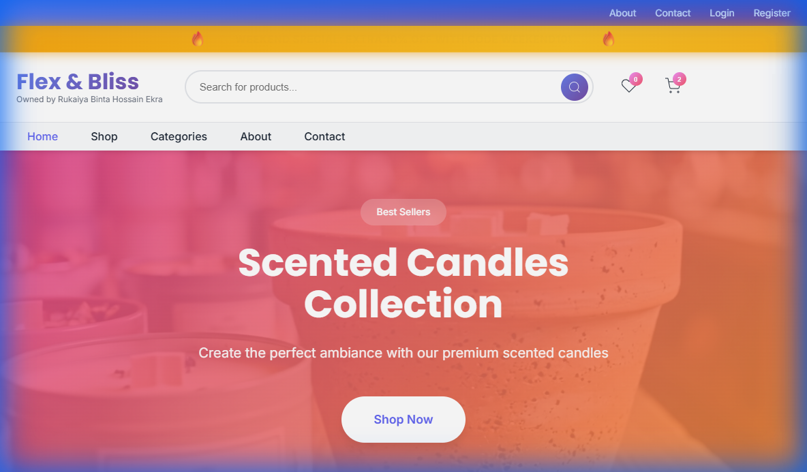
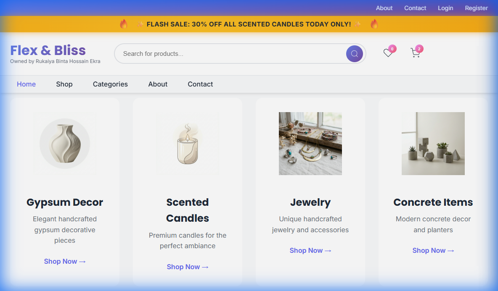

# 🛍️ Flex & Bliss - E-commerce Website

[](https://php.net)
[](https://mysql.com)
[](https://developer.mozilla.org/en-US/docs/Web/JavaScript)
[](https://developer.mozilla.org/en-US/docs/Web/HTML)
[](https://developer.mozilla.org/en-US/docs/Web/CSS)

A full-stack e-commerce website for selling lifestyle products including **Gypsum Decor**, **Scented Candles**, **Jewelry**, **Soaps**, and **Home Decor** items. Built with modern web technologies and designed for XAMPP local development.

---

## 📸 Screenshots

### Homepage - Hero Section


### Homepage - Products Section


---

## ✨ Features

### 🛒 **Shopping Experience**
| Feature | Description |
|---------|-------------|
| **Product Catalog** | Browse products by categories (Gypsum Decor, Candles, Jewelry, Soaps, Home Decor) |
| **Product Search** | Real-time search functionality with instant results |
| **Product Quick View** | Modal popup with detailed product information |
| **Related Products** | Show similar products based on category |
| **Product Reviews** | Customers can rate and review products |
| **Wishlist** | Save favorite products for later |
| **Shopping Cart** | Add/remove items, update quantities, view subtotal |
| **Multi-step Checkout** | 4-step checkout process with progress indicator |
| **Coupon System** | Apply discount codes at checkout |

### 👤 **User Features**
| Feature | Description |
|---------|-------------|
| **User Registration** | Create account with email verification |
| **User Login** | Secure authentication system |
| **Forgot Password** | Password reset via email |
| **User Dashboard** | View profile, order history, and update details |
| **Account Modal** | Quick access to account settings |

### 💳 **Payment & Orders**
| Feature | Description |
|---------|-------------|
| **bKash Integration** | Ready for bKash mobile payment |
| **Cash on Delivery** | COD payment option |
| **Order Tracking** | Track order status and history |
| **Order Confirmation** | Email/on-screen confirmation with order ID |

### 🔐 **Admin Dashboard**
| Feature | Description |
|---------|-------------|
| **Dashboard Overview** | Total users, orders, revenue, and recent activity |
| **Product Management** | Add, edit, delete products |
| **Order Management** | View and update order status |
| **User Management** | View registered users |
| **Log Viewer** | View registration and order logs |
| **Secure Login** | Protected admin access |

### 🔒 **Security Features**
| Feature | Description |
|---------|-------------|
| **CSRF Protection** | Token-based protection against cross-site request forgery |
| **Password Hashing** | Secure password storage |
| **Input Validation** | Server-side validation for all forms |
| **Protected Logs** | Log files protected from web access via `.htaccess` |

### 📱 **UI/UX Features**
| Feature | Description |
|---------|-------------|
| **Responsive Design** | Works on desktop, tablet, and mobile |
| **Dark/Light Theme** | Theme toggle for user preference |
| **Smooth Animations** | Modern transitions and micro-animations |
| **Toast Notifications** | Feedback messages for user actions |
| **Mobile Navigation** | Hamburger menu for mobile devices |
| **Modals** | Quick View, Checkout, Account, Contact, About modals |

---

## 🚀 Tech Stack

| Layer | Technologies |
|-------|--------------|
| **Frontend** | HTML5, CSS3, Vanilla JavaScript |
| **Backend** | PHP 7.4+ |
| **Database** | MySQL 8.0+ |
| **Server** | Apache (via XAMPP) |
| **Fonts** | Google Fonts (Inter, Poppins) |
| **Icons** | Custom PNG icons |

---

## 📁 Project Structure

```
FinalWeb(HTML)/
├── 📄 index.html              # Main storefront page
├── 📄 styles.css              # Global styling (52KB)
├── 📄 script.js               # Core JavaScript logic (77KB)
├── 📄 products.js             # Product catalog data
├── 📄 dashboard.php           # User dashboard
├── 📄 login.php               # User login page
├── 📄 register.php            # User registration
├── 📄 forgot_password.php     # Password recovery
├── 📄 reset_password.php      # Password reset
├── 📄 verify_email.php        # Email verification
├── 📄 flexbliss_deploy_FULL.sql # Complete database schema
│
├── 📁 admin/                  # Admin panel
│   ├── index.php              # Admin dashboard
│   ├── products.php           # Product management
│   ├── view_logs.php          # Log viewer
│   └── styles.css             # Admin styling
│
├── 📁 api/                    # REST API endpoints (19 files)
│   ├── get_products.php       # Fetch products
│   ├── add_product.php        # Add new product
│   ├── update_product.php     # Update product
│   ├── delete_product.php     # Delete product
│   ├── submit_order.php       # Process orders
│   ├── get_orders.php         # Fetch orders
│   ├── validate_coupon.php    # Validate discount codes
│   ├── register_user.php      # User registration
│   ├── login.php              # User authentication
│   ├── wishlist.php           # Wishlist operations
│   ├── reviews.php            # Product reviews
│   └── ... more endpoints
│
├── 📁 includes/               # Core PHP includes
│   ├── config.php             # Database configuration
│   ├── db.php                 # Database connection
│   ├── auth.php               # Authentication functions
│   └── logger.php             # Logging utilities
│
├── 📁 logs/                   # Application logs (protected)
├── 📁 images/                 # Product and site images
├── 📁 uploads/                # User-uploaded content
└── 📁 screenshots/            # README screenshots
```

---

## ⚙️ Installation & Setup (XAMPP)

### Prerequisites
- [XAMPP](https://www.apachefriends.org/) installed on your system
- Web browser (Chrome, Firefox, Edge)
- Git (optional, for cloning)

### Step 1: Clone the Repository
```bash
git clone https://github.com/Shovon021/CSE479-Web-Programming.git
```

Or download and extract the ZIP file.

### Step 2: Copy to XAMPP htdocs
Copy the project folder to your XAMPP installation:
```
C:\xampp\htdocs\CSE479-Web-Programming\
```

### Step 3: Start XAMPP Services
1. Open **XAMPP Control Panel**
2. Start **Apache** (click Start button)
3. Start **MySQL** (click Start button)
4. Both should show green "Running" status

### Step 4: Create Database
1. Open phpMyAdmin: http://localhost/phpmyadmin
2. Click **"Import"** tab
3. Click **"Choose File"** and select `flexbliss_deploy_FULL.sql`
4. Click **"Go"** to import
5. Verify `flexbliss_db` database is created with tables

### Step 5: Configure Database Connection
Open `includes/config.php` and verify settings:
```php
define('DB_HOST', 'localhost');
define('DB_NAME', 'flexbliss_db');
define('DB_USER', 'root');
define('DB_PASS', ''); // Empty for default XAMPP
```

### Step 6: Access the Website

| Page | URL |
|------|-----|
| **Main Website** | http://localhost/CSE479-Web-Programming/index.html |
| **User Login** | http://localhost/CSE479-Web-Programming/login.php |
| **User Register** | http://localhost/CSE479-Web-Programming/register.php |
| **User Dashboard** | http://localhost/CSE479-Web-Programming/dashboard.php |
| **Admin Panel** | http://localhost/CSE479-Web-Programming/admin/index.php |

### Admin Login Credentials
```
Username: shovon
Password: shovon021
```

---

## 🧪 Testing the Application

### Test User Registration
1. Go to the registration page
2. Fill in: Name, Email, Phone, Address, Password
3. Click "Register"
4. Verify success message

### Test Shopping Flow
1. Browse products on homepage
2. Click "Add to Cart" on any product
3. Open cart (click cart icon)
4. Click "Proceed to Checkout"
5. Complete 4-step checkout
6. Verify order confirmation

### Test Admin Dashboard
1. Go to admin login
2. Login with credentials above
3. View dashboard stats
4. Manage products, orders, users

---

## 🗄️ Database Schema

### Tables
| Table | Description |
|-------|-------------|
| `users` | User accounts and profiles |
| `orders` | Order records |
| `order_items` | Individual items in orders |
| `products` | Product catalog |
| `categories` | Product categories |
| `reviews` | Product reviews/ratings |
| `coupons` | Discount codes |
| `wishlist` | User wishlists |

---

## 📋 API Endpoints

| Endpoint | Method | Description |
|----------|--------|-------------|
| `/api/get_products.php` | GET | Fetch all products |
| `/api/add_product.php` | POST | Add new product |
| `/api/update_product.php` | POST | Update product |
| `/api/delete_product.php` | POST | Delete product |
| `/api/submit_order.php` | POST | Submit order |
| `/api/get_orders.php` | GET | Fetch orders |
| `/api/validate_coupon.php` | POST | Validate coupon |
| `/api/register_user.php` | POST | Register user |
| `/api/login.php` | POST | User login |
| `/api/wishlist.php` | GET/POST | Wishlist operations |
| `/api/reviews.php` | GET/POST | Product reviews |

---

## 🔧 Troubleshooting

### Database Connection Error
- Ensure MySQL is running in XAMPP
- Verify database was imported correctly
- Check `config.php` settings

### Page Not Loading
- Ensure Apache is running
- Check URL matches folder name in htdocs
- Try http://localhost first

### Orders Not Saving
- Check browser console (F12) for errors
- Verify `logs` folder has write permissions
- Check database tables exist

---

## 📝 Notes

> ⚠️ **Development Only**: This setup is for local development. For production:
> - Change admin credentials
> - Secure database password
> - Enable HTTPS
> - Implement proper error handling

---

## 👨‍💻 Author

**Shovon021**

📌 CSE479 - Web Programming Project

---

## 📜 License

This project is for educational purposes (CSE479 Web Programming course).
